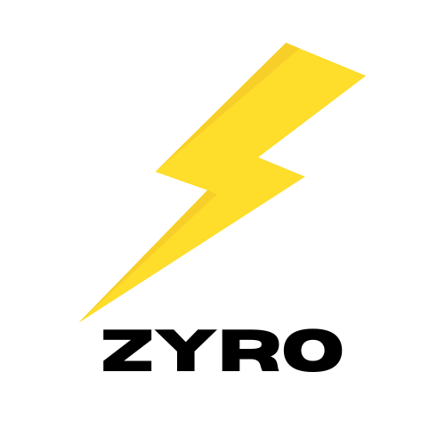

# Zyro

## 🚀 Simple & Lightweight Zig HTTP Framework
Zyro is a minimal, high-performance HTTP framework written in Zig. It is designed to be lightweight, fast, and easy to use, making it an excellent choice for building web applications and APIs.

---

## ✨ Features
✅ **Lightweight & Fast** – Optimized for performance with minimal overhead.

✅ **Zero Dependency** – Just improve zig standard library.

✅ **Zig-Powered** – Fully written in Zig, leveraging its safety and performance benefits.

✅ **Routing Support** – Easily define routes for handling HTTP requests.

✅ **Middleware Support** – Extend functionality with custom middleware.

✅ **Streaming & Chunked Responses** – Efficiently handle large payloads.

✅ **Asynchronous Handling** – High concurrency support without external dependencies.

---

## 💡 Contributing
We welcome contributions from the community! If you're interested in improving Zyro, feel free to:

- Report issues or suggest features.
- Submit pull requests with bug fixes or enhancements.
- Help improve the documentation.

To get started, check out our repository and open an issue or pull request. Let's build something great together! 🚀

---

## 📜 License
Zyro is open-source and licensed under the MIT License.

---

🚀 **Join the Zyro community and contribute today!**
